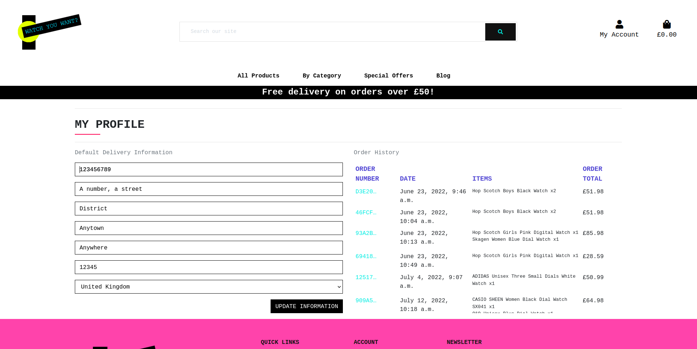
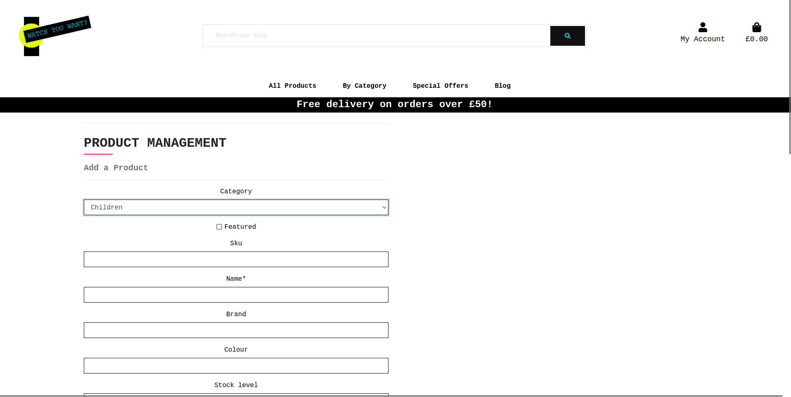

# Watch You Want?

[]

Click [here](https://watchyouwant-pp5.herokuapp.com/) to visit the live site.
------


## Introduction

**Watch You Want?** is a full stack e-commerce website for the 5th and final project of the Code Institute diploma in Software Development (e-commerce applications).

The site is a full B2C e-commerce website for a fictional watch shop selling brand new and restored watches.

The site provides role based permissions for users to interact with a central dataset. It includes user authentication, email validation, full CRUD functionality for approved users for Products, Categories, Blog Posts and Reviews.

The payment system uses Stripe.  Please note that this website is for EDUCATIONAL PURPOSES only and the credit card payment functionality is not set up to accept real payments.  Please do not enter any personal credit/debit card details when using the site.

**Testing interactively**

When testing interactively, use a card number, such as 4242 4242 4242 4242. Enter the card number in the Dashboard or in any payment form.

    Use a valid future date, such as 12/34.
    Use any three-digit CVC (four digits for American Express cards).
    Use any value you like for other form fields. 

This information has been taken directly from the [Stripe testing documentation](https://stripe.com/docs/testing).

## UX

### Ideal User Demographic
#### The ideal users of this website are:
- Gift givers
- Trendy individuals
- Fashion-conscious individuals
- People looking for a treat for themselves
- People who are interested in restoring and reusing old technology

#### Strategy
Broken into three categories, the website will attempt to focus on the following target audiences:
- **Roles:**
     - Site User
     - Site Owner

- **Demographic:**
     - Young to mature adults
     - Gift givers

- **Psychographics:**
    - Personality & Attitudes:
        - Fun-loving
        - Creative
        - Outgoing
        - Playful

    - Values:
        - Fashion conscious
        - Trendsetter
        - Interested in reusing and restoring old technology

    - Lifestyles:
        - Keeps up with the latest trends
        - Likes to wear a quality wrist watch
        - May own more than one wrist watch

The website needs to enable the **Site User** to:
- Find attractive products designed for themselves and their family and friends.
- Add their desired products to the shopping bag for purchasing.
- Filter products according to name, categories, rating and prices.
- Search products by name or description.
- Create a personalised profile to store their personal details and to be able to view past orders.
- Leave a review for a product (if logged in).
- Leave a comment on a blog post (if logged in).

The website needs to enable the **Site Owner** to:
- Add, edit and delete products on the site.
- View orders on the admin screen.
- Add, edit and delete blog posts.
- Approve or delete blog comments.
- Delete reviews.

## Purpose

The app is designed as a e-commerce application that encourages the users to purchase one of the products on the website and the watch restoration blog gives users the opportunity to engage with the website.


## User Stories

#### EPICS
I began with some broad epics that allowed further refinement, resulting in the user stories outlined below:
- EPIC #1: Allow Site User to view what is on the site
- EPIC #2: Allow Site User to manage their own account
- EPIC #3: Allow a Shopper to refine what they are seeing on the screen
- EPIC #4: Allow a Shopper to make a purchase
- EPIC #5: Allow Site Admin to manage the site

#### Site User:
- As a Shopper, I want to be able to view a list of products so that I can select some to purchase.
- As a Shopper, I want to be able to view a specific category of products so that I can quickly find products I’m interested in without having to search through all the products.
- As a Shopper, I want to be able to view individual product details so that I can identify the price, description, product rating, product image and available colours.
- As a Shopper, I want to be able to view reviews of individual products by other shoppers so that I can see what other people have said about the items I am thinking of purchasing.
- As a Shopper, I want to be able to view the site blog and read about real-life watch restoration projects so that I can engage with the site’s content without necessarily having to make a purchase.
- As a Shopper, I want to be able to quickly identify deals, clearance items and special offers so that I can take advantage of special savings on products I’d like to purchase.
- As a Shopper, I want to be able to easily view the total of my purchases at any one time so that I can avoid spending too much!
- As a User, I want to be able to easily register for an account so that I can have a personal account and be able to view my profile.
- As a User, I want to be able to easily log in or out so that I can access my personal account information.
- As a User, I want to be able to easily recover my password in case I forget it so that I can recover access to my account.
- As a User, I want to be able to receive an email confirmation after registering so that I can verify my account registration was successful.
- As a User, I want to be able to leave a comment on a blog post so that I can engage with the site’s content without necessarily having to make a purchase.
- As a User, I want to be able to leave a review for an individual product I have purchased so that I can let other site user’s know what I think of something I have previously purchased.
- As a User, I want to be able to have a personalised user profile so that I can view my personal order history and order confirmations and save my payment information.
- As a Shopper, I want to be able to sort the list of available products so that I can easily identify the best rated, best priced and categorically sorted products.
- As a Shopper, I want to be able to sort a specific category of products so that I can find the best priced or best rated product in a particular category, or sort the products in that category by name.
- As a Shopper, I want to be able to sort multiple categories of products simultaneously so that I can find the best priced or best rated products across multiple categories, such as “Men’s Watches” and “Unisex Watches”.
- As a Shopper, I want to be able to search for a product by name or description so that I can find a specific product I’d like to purchase.
- As a Shopper, I want to be able to easily see what I’ve searched for and the number of results so that I can quickly decide if the product I want is available.
- As a Shopper, I want to be able to view items in my bag to be purchased so that I can identify the total cost of my purchase and all the items I will receive.
- As a Shopper, I want to be able to easily select the quantity of a product when purchasing it so that I can ensure I don’t accidentally select the wrong product or quantity.
- As a Shopper, I want to be able to adjust the quantity of individual items in my bag so that I can easily make changes to my purchase before checkout.
- As a Shopper, I want to be able to easily enter my payment information so that I can checkout quickly and with no hassles.
- As a Shopper, I want to be able to feel my personal and payment information is safe and secure so that I can confidently provide the required information to make a purchase.
- As a Shopper, I want to be able to view an order confirmation after checkout so that I can verify that I haven't made any mistakes.
- As a Shopper, I want to be able to receive an email confirmation after checkout so that I can keep the confirmation of what I’ve purchased for my records.

#### Site Admin:
- As a Site Admin, I want to be able to add a product so that I can add new items to my store.
- As a Site Admin, I want to be able to edit and update products so that I can change product prices, descriptions, images and other product criteria.
- As a Site Admin, I want to be able to delete a product so that I can remove items that are no longer for sale.
- As a Site Admin, I want to be able to write a blog post so that I can add new posts to my blog.
- As a Site Admin, I want to be able to edit/update a blog post so that I can change aspects of my blog, correct spelling mistakes, update images and other.
- As a Site Admin, I want to be able to delete a blog post so that I can remove blog posts that are no longer relevant.
- As a Site Admin, I want to be able to approve comments on my blog so that I can filter out any spam or irrelevant comments.
- As a Site Admin, I want to be able to delete comments on my blog so that I can filter out any spam or irrelevant comments.
- As a Site Admin, I want to be able to approve product reviews so that I can remove comments that are spam or offensive.
- As a Site Admin, I want to be able to delete product reviews so that I can remove product reviews that are irrelevant or unhelpful.


With the user stories in mind, I created the below strategy table to determine the trade-off of importance and viability with the following results: INSERT STRATEGY TABLE

### User Stories that have been satisfied by creation of particular apps in ths project:


**EPIC #1: Allow Site User to view what is on the site**
| id  |  content | how was it satisfied
| ------ | ------ | ------ |
|  [#1](https://github.com/Kat632/watchyouwant/issues/7) | As a Shopper, I want to be able to view a list of products so that I can select some to purchase | navigation, home page, products page |
|  [#2](https://github.com/Kat632/watchyouwant/issues/8) | As a Shopper, I want to be able to view a specific category of products so that I can quickly find products I’m interested in without having to search through all the products. | navigation, home page, products page |
|  [#3](https://github.com/Kat632/watchyouwant/issues/9) | As a Shopper, I want to be able to view individual product details so that I can identify the price, description, product rating, product image and available colours. | product details page |
|  [#4](https://github.com/Kat632/watchyouwant/issues/10) | As a Shopper, I want to be able to view reviews of individual products by other shoppers so that I can see what other people have said about the items I am thinking of purchasing. | review app on product details page |
|  [#5](https://github.com/JKat632/watchyouwant/issues/11) | As a Shopper, I want to be able to view the site blog and read about real-life watch restoration projects so that I can engage with the site’s content without necessarily having to make a purchase. | blog app |
|  [#6](https://github.com/Kat632/watchyouwant/issues/12) | As a Shopper, I want to be able to quickly identify deals, clearance items and special offers so that I can take advantage of special savings on products I’d like to purchase. | navigation, home page, products page |
|  [#7](https://github.com/Kat632/watchyouwant/issues/13) | As a Shopper, I want to be able to easily view the total of my purchases at any one time so that I can avoid spending too much! | cart app |

**EPIC #2: Allow Site User to manage their own account**
| id  |  content | how was it satisfied
| ------ | ------ | ------ |
|  [#8](https://github.com/Kat632/watchyouwant/issues/14) | As a User, I want to be able to easily register for an account so that I can have a personal account and be able to view my profile. | profile app |
|  [#9](https://github.com/Kat632/watchyouwant/issues/15) | As a User, I want to be able to easily log in or out so that I can access my personal account information. |  profile app |
|  [#10](https://github.com/Kat632/watchyouwant/issues/16) | As a User, I want to be able to easily recover my password in case I forget it so that I can recover access to my account. |  profile app |
|  [#11](https://github.com/Kat632/watchyouwant/issues/17) | As a User, I want to be able to receive an email confirmation after registering so that I can verify my account registration was successful. |  profile app |
|  [#12](https://github.com/Kat632/watchyouwant/issues/18) | As a User, I want to be able to leave a comment on a blog post so that I can engage with the site’s content without necessarily having to make a purchase. |  blog app |
|  [#13](https://github.com/Kat632/watchyouwant/issues/19) | As a User, I want to be able to leave a review for an individual product I have purchased so that I can let other site user’s know what I think of something I have previously purchased. | review app |
|  [#14](https://github.com/Kat632/watchyouwant/issues/20) | As a User, I want to be able to have a personalised user profile so that I can view my personal order history and order confirmations and save my payment information. | profile app |

**EPIC #3: Allow a Shopper to refine what they are seeing on the screen**
| id  |  content | how was it satisfied
| ------ | ------ | ------ |
|  [#15](https://github.com/Kat632/watchyouwant/issues/21) | As a Shopper, I want to be able to sort the list of available products so that I can easily identify the best rated, best priced and categorically sorted products. | products app |
|  [#16](https://github.com/Kat632/watchyouwant/issues/22) | As a Shopper, I want to be able to sort a specific category of products so that I can find the best priced or best rated product in a particular category, or sort the products in that category by name. | products app |
|  [#17](https://github.com/Kat632/watchyouwant/issues/23) | As a Shopper, I want to be able to sort multiple categories of products simultaneously so that I can find the best priced or best rated products across multiple categories, such as “Men’s Watches” and “Unisex Watches”. | products app |
|  [#18](https://github.com/Kat632/watchyouwant/issues/24) | As a Shopper, I want to be able to search for a product by name or description so that I can find a specific product I’d like to purchase. |  products app, site-wide search bar |
|  [#19](https://github.com/Kat632/watchyouwant/issues/25) | As a Shopper, I want to be able to easily see what I’ve searched for and the number of results so that I can quickly decide if the product I want is available. | products app |

**EPIC #4: Allow a Shopper to make a purchase**
| id  |  content | how was it satisfied
| ------ | ------ | ------ |
|  [#20](https://github.com/github.com/Kat632/watchyouwant/issues/27) | As a Shopper, I want to be able to view items in my bag to be purchased so that I can identify the total cost of my purchase and all the items I will receive. | bag app |
|  [#21](https://github.com/Kat632/watchyouwant/issues/26) | As a Shopper, I want to be able to easily select the quantity of a product when purchasing it so that I can ensure I don’t accidentally select the wrong product or quantity. | bag app |
|  [#21](https://github.com/Kat632/watchyouwant/issues/28) | As a Shopper, I want to be able to adjust the quantity of individual items in my bag so that I can easily make changes to my purchase before checkout. | bag app |
|  [#22](https://github.com/Kat632/watchyouwant/issues/29) | As a Shopper, I want to be able to easily enter my payment information so that I can checkout quickly and with no hassles. | checkout app |
|  [#23](https://github.com/Kat632/watchyouwant/issues/30) | As a Shopper, I want to be able to feel my personal and payment information is safe and secure so that I can confidently provide the required information to make a purchase. | checkout app |
|  [#24](https://github.com/Kat632/watchyouwant/issues/31) | As a Shopper, I want to be able to view an order confirmation after checkout so that I can verify that I haven't made any mistakes. | checkout app |
|  [#25](https://github.com/Kat632/watchyouwant/issues/32) | As a Shopper, I want to be able to receive an email confirmation after checkout so that I can keep the confirmation of what I’ve purchased for my records. | checkout app |

**EPIC #5: Allow Site Admin to manage the site**
| id  |  content | how was it satisfied
| ------ | ------ | ------ |
|  [#26](https://github.com/Kat632/watchyouwant/issues/33) | As a Site Admin, I want to be able to add a product so that I can add new items to my store. | admin panel, products app |
|  [#27](https://github.com/Kat632/watchyouwant/issues/34) | As a Site Admin, I want to be able to edit and update products so that I can change product prices, descriptions, images and other product criteria. | admin panel, products app
|  [#28](https://github.com/Kat632/watchyouwant/issues/35) | As a Site Admin, I want to be able to delete a product so that I can remove items that are no longer for sale. | admin panel, products app |
|  [#29](https://github.com/Kat632/watchyouwant/issues/36) | As a Site Admin, I want to be able to write a blog post so that I can add new posts to my blog. | admin panel, blog app |
|  [#30](https://github.com/Kat632/watchyouwant/issues/37) | As a Site Admin, I want to be able to edit/update a blog post so that I can change aspects of my blog, correct spelling mistakes, update images and other. | admin panel, blog app |
|  [#31](https://github.com/Kat632/watchyouwant/issues/38) | As a Site Admin, I want to be able to delete a blog post so that I can remove blog posts that are no longer relevant. | admin panel, blog app |
|  [#32](https://github.com/Kat632/watchyouwant/issues/39) | As a Site Admin, I want to be able to approve comments on my blog so that I can filter out any spam or irrelevant comments. | admin panel, blog app |
|  [#33](https://github.com/Kat632/watchyouwant/issues/40) | As a Site Admin, I want to be able to delete comments on my blog so that I can filter out any spam or irrelevant comments. | admin panel, blog app |
|  [#34](https://github.com/Kat632/watchyouwant/issues/41) | As a Site Admin, I want to be able to approve product reviews so that I can remove comments that are spam or offensive. | admin panel, reviews app |
|  [#35](https://github.com/Kat632/watchyouwant/issues/42) | As a Site Admin, I want to be able to delete product reviews so that I can remove product reviews that are irrelevant or unhelpful. | admin panel, reviews app |


### User stories that are planned for next sprint

| id  |  content | 
| ------ | ------ |


##


## Website Architecture

### Database Schema

A relational database has been used to deliver the expected functionality.  SQLite was used in the development of the site and Postgres provided by the Heroku platform is being used in production.  The diagram below shows the database models and the relationships between them.


### Site Structure

I prepared a site map diagram in order to keep track of the templates I needed to create and to see how the site would flow.


## Skeleton

### Wireframes

WIREFRAMES!!!!!


## Surface

### Main colours

The overall design of the **Watch You Want?** website takes inspiration from [United Colours of Benetton](https://gb.benetton.com/) and [Swatch](https://www.swatch.com/).  I wanted a simple, clean site with a 1980s vibe and neon colours.  I felt that this would help to differentiate the site from the ones mentioned below. in [Inspirations]  - NEED LINK!

This conrast grid shows how all the colours fit together.  Further information about my design inspiration can be found in [this section](#tutorials-and-inspiration). - LINK DOESN'T GO ANYWHERE


### Inspirations
Having extensively researched e-commerce websites, and then latterly specific watch websites, I knew that I wanted the website to have a white background and to not be overly busy.  My research led me to [Watch Shop](https://www.watchshop.com/) and to [House of Watches](https://www.houseofwatches.co.uk/), both of which served as inspiration for **Watch You Want?**.

### Text

I deliberately decided to only use one font throughout the site.  My chosen font is Courier New, which is a TrueType font.  It is scaleable, in that it doesn't get jagged edges when enlarged and the font is versatile enough using different font weights and uppercase to be sufficient for both headlines and other text.

Courier has a typewriter feel, indeed according to [this](https://en.wikipedia.org/wiki/Courier_(typeface)) Wikipedia article, it was developed for IBM's first typewriters.  I felt that this added to the retro style of the website.

## Technologies Used

### Languages Used

   + HTML5
   + CSS3
   + JavaScript
   + jQuery
   + Python
   + Django

### Technologies and Programs Used:
+ GitHub
    The Git was used for version control.
    Git issues were used for user stories.
    GitPod was used as IDE to write the code and push to GitHub.
+ Heroku 
    The page was deployed to Heroku.
+ PostgreSQL
    PostgreSQL was used as database for this project
+ VSCode
    VSCode was used for testing out code snippets and for drafing the .md files.
+ Stripe
    In order for the user to make payments.
+ AWS S3 bucket storage
    For storing static files and media files.

### Frameworks Libraries and Programs Used
+ Bootstrap 4
+ Fontawesome
+ Django
+ Django Summernote
+ Django Crispy Forms

### Product database
+ Kaggle:
    I chose [this database](https://www.kaggle.com/datasets/paramaggarwal/fashion-product-images-dataset) from Kaggle.  I started with a 25gb file which I then pared down to just watches.  At this point it was still 2000 items, so I took around 45 products and their images and created my database from there.

    I created a spreadsheet of my products and their categories and used [jsonformatter.org] to create my fixtures files.

## **Existing Features**

### **Navbar and Footer**


A wide, deep navbar, incoporating a large logo and large icons has been designed for desktop users and narrow, simple navbar for mobile phone users. Each navbar appears and disapears according to bootstrap classes. 

### **Footer**
The footer is also wide and deep and is divided into three sections.  The first section is a logo that if clicked will take the user back to the home page.  The second section is a list of links pertaining to the user's account, in addition to links to the Privacy Policy, the Terms & Conditions and a link to the Contact Us page.  The third section has a link to sign up for the newsletter and links to social media presences.

### **Shop**


Each individual watch is set on its own bootstrap card. Cards are organised in grid utilising bootstrap classes. The mobile phone user will see one card in a row, medium screens will show 2 cards in a row and large screens will have 4 cards in a row.

Each card has the name of the product, an image of the product, the price and the rating.  If the user is logged in as a superuser, they will also be able to edit and delete a product from here.  If a superuser chooses to delete a product, a modal will appear asking them to confirm that this is what they want to do.

When a product image is clicked, it takes the user to a page with more details about the given product.

### **Product Detail page**


The top of the product detail page is divided into two halves.  The left-hand half contains a large product image and the right-hand half contains all the other details about the product, such as a longer description and features of the product.  At the bottom of this section is where the user can to change the quantity of the item, if they wish to purchase more than one and then add the product to their bag.  It is also possible to see if an item is out of stock here.  If an item is out of stock, the increment quantity buttons will not work and a user won't be able to add an item to their bag.

On mobile devices, this entire section will be in one column.

A superuser is able to edit or delete a product from this page of the website.  If a user chooses to delete a product, a modal will appear asking them to confirm that this is what they want to do.


The bottom of the product detail page is the review section.  A user can see reviews for the product they are viewing and logged-in users are also able to leave a review and a star-rating for the product.

### **Shopping bag**


On the shopping bag page the user is able to see everything in their bag, including a product image, the quantity of the item they are ordering and the sub total of that item.  The user is also able to add more of an item to their bag, reduce the quantity or completely remove an item from their bag.  The subtotal and the bag total will respond accordingly.

There are two buttons at the bottom.  If the user clicks on Keep Shopping it will take them back to the All Products page and if they click Secure Checkout, it will take them to the checkout page.

### **Checkout page**


The checkout page is divided into two halves.  One half has a form for the user to input their details, and the other one has a summary of the order about to be purchased.  If the user is logged in, this form will appear pre-filled with their details if they have saved them to their account previously.  A user will always have to fill in their credit card details because the website does not store these details.

There are two buttons at the bottom.  One will take the user back to their bag if they wish to adjust it and the second one confirms the payment.

### **Order confirmation**


The order confirmation page allows the user to see a summary of what they have just paid for, the address it is being sent to and successful completion of an order sends an email to the user.

### **Blog**


Each individual blog post is set on its own bootstrap card. Cards are organised in grid utilising bootstrap classes. The mobile phone user will see one card in a row, medium screens will show 2 cards in a row and large screens will have 3 cards in a row.

Each card has the title of the blog post, an image pertaining to the blog post, the author at the top and the number of post likes and comments at the bottom.


The blog detail page has the title of the post, the author, the date, the number of likes and the number of comments displayed in a panel at the top of the page.  The main body of the blog displays in a bootstrap card with the featured image at the top and then the text and any other images that have been added to the blog post below.

Any comments that have been made on a blog post are displayed at the bottom of the page and there is a form for a logged in user to leave a comment if they wish, otherwise there is a prompt to login or register in order to leave a comment.

### **Profile**



On the profile page, a user can update their personal delivery information which will ensure that the checkout form is pre-filled and they can also see their past order history.  Clicking on a past order will take a user to the order confirmation page for that particular order and it pops a toast in the top right of the screen to inform them that they are viewing a past order.

### **Product Management**



A superuser is able to add or edit a product from the front end of the website.

## **Future Features**

### **Stock Management**

I started to implement a basic stock system, but unfortunately only managed to get so far with it during the timeframe to complete my project.  

Currently, each product has a stock level which is inputted manually by the site administrator.  This is only relevant to a site user when a product is out of stock.  If a product is out of stock, then the site user cannot add it to their basket.

Ideally the stock of an item would reduce when it has been purchased and upon completion of a successful checkout.

### **Star Rating System**

The site currently gets the star ratings from two different places.  The first one is seen in product details and is added to the product by the site administrator.  The second one is added by the site user when they leave a review.  The review rating is not related to the product rating in any way.  In the future I will find a more elegant way of doing this and combining the two together in order to make the information more meaningful.

### **Reviews**

A logged in user is currently able to leave a review for every product, regardless of whether or not they have previously purchased it.  In the future I would like to be able to limit a user's ability to leave a review to only products they have purchased.  I just ran out of time to implement this.

## **Web Marketing**

### **SEO**

The site has been equipped with a sitemap generated [here](https://www.xml-sitemaps.com/) and robots.txt. 

The site also has a Privacy Policy and Terms and Conditions - both documents generated [here](https://policymaker.io/).

I have one issue with images that have been uploaded to the body of the blog.  I have not found a way to give them alt texts.  I did some very scant investigations into the capabilities of Django Summernote.  However, this does not appear to be too much of a problem with my Lighthouse score - SEE TESTING.MD INSERT LINK and so I have decided to not look into it further.  

## **Keywords**

The meta tags and descriptions have been updated for SEO purposes.  The main site does not contain very much copy, other than in the product descriptions and in the yellow block on the home page.  However, keywords will be able to be used with more frequency in the blog.

In order to create the list of keywords for the site, I researched both long and short tail keywords.  

One of the first ways I looked for keywords was by using Google autocomplete, but it does have it's limitations as of course, this method only covers Google.  In addition, I used [Soolve](https://soovle.com/) which covers keyword suggestions across all the major search engines.

Related Searches at the bottom of the first page of Google proved quite useful for long tail keywords and I also have access to Google Keyword Planner through a Google Adwords account I have for my real-life business.

Finally, I had some interesting results using [Answer The Public](https://answerthepublic.com/reports/208f59e1-6934-4804-bae1-27c3fe8add44) to find more question-based long tail keywords.  This method of keyword research could be useful for planning blog post content too, as you can see the questions the potential audience is asking.

### **Newsletter**

A customer does not have to be registered in order to sign up for the newsletter.  Anyone who registers to receive the newsletter is automatically added to the **Watch You Want?** newsletter subscribers list in Mailchimp.

### **Facebook**

Social media marketing in the form of Facebook or Instagram is a way to become identifiable to the community you are trying to reach.  For this project I had to set up a Facebook page as part of one of the assessment criteria for the project.

Here is a [link to the Facebook page I created](https://www.facebook.com/Watch-You-Want-103162945806977).  Please note that this page may be removed by Facebook at some point because it is not for a real business.  Therefore I have included two screenshots of the page at time of writing.


| Watch You Want Facebook banner and logo |

| Watch You Want Facebook sample post |


## **Code Validation**

Please see testing.md - NEED LINK!

## **Testing**

Please see testing.md - NEED LINK!

## **Project Bugs and Solutions**

Please see testing.md

## **Deployment and making a clone**

### **Deployment to Heroku**

**In your app** 

1. add the list of requirements by writing in the terminal "pip3 freeze --local > requirements.txt"
2. Git add and git commit the changes made

**Log into heroku**

3. Log into [Heroku](https://dashboard.heroku.com/apps) or create a new account and log in

4. top right-hand corner click "New" and choose the option Create new app, if you are a new user, the "Create new app" button will appear in the middle of the screen

5. Write app name - it has to be unique, it cannot be the same as this app
6. Choose Region - I am in Europe
7. Click "Create App"

**The page of your project opens**

8. Go to Resources Tab, Add-ons, search and add Heroku Postgres

9. Choose "settings" from the menu on the top of the page

10. Go to section "Config Vars" and click button "Reveal Config Vars". 

11. Add the below variables to the list

    * Database URL will be added automaticaly
    * Secret_key - is the djnago secret key can be generated [here](https://miniwebtool.com/django-secret-key-generator/). 


**Go back to your code**

12. Procfile needs to be created in your app
```
web: gunicorn PROJ_NAME.wsgi
```

13. In settings in your app add Heroku to ALLOWED_HOSTS

14. Add and commit the changes in your code and push to github

**Final step - deployment**

15. Next go to "Deploy" in the menu bar on the top 

16. Go to section "deployment method", choose "GitHub"

17. New section will appear "Connect to GitHub" - Search for the repository to connect to

18. type the name of your repository and click "search"

19. once Heroku finds your repository - click "connect"

20. Scroll down to the section "Automatic Deploys"

21. Click "Enable automatic deploys" or choose "Deploy branch" and manually deploy

22. Click "Deploy branch"

Once the program runs:
You should see the message "the app was successfully deployed"

23. Click the button "View"

The live link can be found [here](https://watchyouwant-pp5.herokuapp.com/).

### Forking the GitHub Repository

By forking the GitHub Repository you will be able to make a copy of the original repository on your own GitHub account allowing you to view and/or make changes without affecting the original repository by using the following steps:

1. Log in to GitHub and locate the [GitHub Repository](https://github.com/Kat632/watchyouwant)
2. At the top of the Repository (not top of page) just above the "Settings" button on the menu, locate the "Fork" button.
3. You should now have a copy of the original repository in your GitHub account.

### Making a Local Clone

1. Log in to GitHub and locate the [GitHub Repository](https://github.com/Kat632/watchyouwant)
2. Under the repository name, click "Clone or download".
3. To clone the repository using HTTPS, under "Clone with HTTPS", copy the link.
4. Open commandline interface on your computer
5. Change the current working directory to the location where you want the cloned directory to be made.
6. Type `git clone`, and then paste the URL you copied in Step 3.

```
$ git clone https://github.com/Kat632/watchyouwant
```

7. Press Enter. Your local clone will be created.

### Setting up your local enviroment

1. Create Virtual enviroment on your computer or use gitpod built in virtual enviroment feature.

2. Create env.py file. It needs to contain those 5 variables.

* Database URL can be obtained from [heroku](https://dashboard.heroku.com/), add PostgreSQL as an add on when creating an app. 
* Secret_key - is the djnago secret key can be generated [here](https://miniwebtool.com/django-secret-key-generator/). 
* Cloudinary URL can be obtained from [cloudinary](https://cloudinary.com/) follow the steps on the website to register. 
* Google API key can be obtained [here](https://cloud.google.com/gcp?authuser=1) you will have to register with google and create new app to get the API key. Follow the instructions on the website.

```
DEVELOPMENT
SECRET_KEY

STRIPE_PUBLIC_KEY
STRIPE_SECRET_KEY 
STRIPE_WH_SECRET

```
PostgreSQL and AWS keys are needed only on Heroku, not in local IDE

3. Run command 
```
pip3 install -r requirements.txt
```
### Getting Stripe keys
Go to developers tab. On side menu you will find API keys. Copy STRIPE_PUBLIC_KEY and STRIPE_SECRET_KEY.

Go to Webhooks. Click Add Endpoint button in top right hand corner.
Add endpoint URL (your local or deployed URL)
Add all events 
Than click add endpoint
You should be redirected to this webhook's page. Reveal webhook sign in secret and copy to Settings and to heroku as STRIPE_WH_SECRET variable

### Getting email variables from gmail


- Log into gmail account
- Go to Settings and than See all settings
- Top menu go to Accounts and import
- Find on the list Other google account settings
- Left side menu - Security
- Turn on two step verification: add phone number and follow instructions
- Go back to security
App passwords - Select Mail, Select Device - Other, Django, Copy app password.

In Heroku 
EMAIL_HOST_PASS is the password copied from above.
EMAIL_HOST_USER is the gmail email address


### Setting AWS bucket


1. Go to [Amzon Web Services](https://aws.amazon.com/) page and login or register

2. You should be redirected to AWS Managment Console, if not click onto AWS logo in top left corner or click Services icon and choose Console Home

3. Below the header AWS Services click into All Services and find **S3** under Storage

4. Create New Bucket using **Create Bucket** button in top right hand corner

- **Configuration:** type in your chosen name for the bucket (preferably matching your heroku app name) and AWS Region closest to you

- **Object ownership:** ACLs enabled, Bucket owner prefered

- **Block Public Access settings:** Uncheck to allow public access, Acknowledge that the current settings will result that the objects within the bucket will become public

- Click **Create Bucket**

5. You are redirected to Amazon S3 with list of your buckets. Click into the name of the bucket you just created

6. Find the tab **Properties** on the top of the page:
**Static website hosting** at the bottom of the properties page: clik to edit, click enable, fill in index document: index.html and error.html for error

7. On the **Permissions** tab:
- Cross-origin resource sharing (**CORS**) Paste in the below code as configuration and save

```
[
  {
      "AllowedHeaders": [
          "Authorization"
      ],
      "AllowedMethods": [
          "GET"
      ],
      "AllowedOrigins": [
          "*"
      ],
      "ExposeHeaders": []
  }
]
```
- **Bucket Policy** within permissions tab: Edit bucket policy
Click AWS Policy Generator (top right corner)

Select type of policy: S3 Bucket policy
Principal: * (allows all)
Actions: Get object
Amazon Resource Name (ARN): paste from the Edit bucket policy page in permissions
Click Add statement Than Click Generate Policy and Copy the policy into bucket policy editor. 
In the policy code find "Resource" key and add "/*" after the name of the bucket to enable all
Save changes

- **Access control list (ACL)** within permissions tab: click Edit

find Everyone (public access) and check List box and save

8. Identity and Access Management (IAM)
Go back to the AWS Management Console and find IAM in AWS Services

- side menu - User Groups and click **Create Group**
name group "manage-your-app-name" and click Create group

- side menu - Policies and click **Create Policy**
Click import managed policy - find AmazonS3FullAccess
Copy ARN again and paste into "Resource" add list containint two elements "[ "arn::..", ""arn::../*]" First element is for bucket itself, second element is for all files and foldrs in the bucket

Click bottom right Add Tags, than Click bottom right Next: Review
Add name of the policy and description

Click bottom right Create policy

9. Attach policy to the group we created:
- go to User Groups on side menu
- select your group from the list
- go to permissions tab and add permissions drop down and choose **Attach policies**
- find the policy created above and click button in bottom right Add permissions

10. Create User to go in the group
- **Users** in the side menu and click add users

User name: your-app-staticfiles-user
Check option: Access key - Programmatic access
Click button at the bottom right for Next
- Add user group and add user to the group you created earlier
Click Next Tags and Next: review and Create user
- Download .csv file


11. Connect django to AWS S3 bucket
- install boto3
- install django-storages
- freeze to requirements.txt
- add storages to installed apps in settings.py

```
if 'USE_AWS' in os.environ:
    # Cache control
    AWS_S3_OBJECT_PARAMETERS = {
        'Expires': 'Thu, 31 Dec 2099 20:00:00 GMT',
        'CacheControl': 'max-age=94608000',
    }

    # Bucket Config
    AWS_STORAGE_BUCKET_NAME = os.getenv('AWS_STORAGE_BUCKET_NAME')
    AWS_S3_REGION_NAME = 'eu-west-2'
    AWS_ACCESS_KEY_ID = os.getenv('AWS_ACCESS_KEY_ID')
    AWS_SECRET_ACCESS_KEY = os.getenv('AWS_SECRET_ACCESS_KEY')
    AWS_S3_CUSTOM_DOMAIN = f'{AWS_STORAGE_BUCKET_NAME}.s3.amazonaws.com'
```

12. Go to heroku to set up enviromental variables

open CSV file downloaded earlier and copy each variable into heroku Settings

AWS_STORAGE_BUCKET_NAME
AWS_ACCESS_KEY_ID from csv
AWS_SECRET_ACCESS_KEY from csv
USE_AWS = True
remove DISABLE_COLLECTSTATIC variable from heroku

13. Create file in root directory custom_storages.py

```
from django.conf import settings
from storages.backends.s3boto3 import S3Boto3Storage


class StaticStorage(S3Boto3Storage):
    location = settings.STATICFILES_LOCATION


class MediaStorage(S3Boto3Storage):
    location = settings.MEDIAFILES_LOCATION
```

14. Go to settings.py, add the AWS settings

```
    # Static and media files
    STATICFILES_STORAGE = 'custom_storages.StaticStorage'
    STATICFILES_LOCATION = 'static'
    DEFAULT_FILE_STORAGE = 'custom_storages.MediaStorage'
    MEDIAFILES_LOCATION = 'media'

    # Override static and media URLs in production
    STATIC_URL = f'https://{AWS_S3_CUSTOM_DOMAIN}/{STATICFILES_LOCATION}/'
    MEDIA_URL = f'https://{AWS_S3_CUSTOM_DOMAIN}/{MEDIAFILES_LOCATION}/'

```

15. To load the media files to S3 bucket

- Go to your S3 bucket page on AWS. Create new folder "media"
- go to the media folder and click Upload

## Credits 
### Online resources
* [Adobe Stock Images](https://stock.adobe.com/uk/) - I signed up for a free trial, then cancelled it.
* [Unsplash](https://unsplash.com/)
* [Fontawsome](https://fontawesome.com/)
* [Bootstrap 4](https://getbootstrap.com/docs/4.0/getting-started/introduction/)
* [Markdown best practices](https://www.markdownguide.org/basic-syntax/)
* [Markdown Table of content generator](http://ecotrust-canada.github.io/markdown-toc/)
* [Favicon](https://favicon.io/)
* [TINYPNG](https://tinypng.com/)
+ Balsamiq:
    Balsamiq was used to create the wireframes during the design process.

### Offline resources
* All of the images for the blog and for the restored section of the website were provided by my husband, Chris Morley.
* All of the copy for the blog and for the restored section of the website was also provided by my husband and checked by myself for SEO purposes.

* [GIMP](https://www.gimp.org/)
+ Visio:
    Visio was used to create the models schema and the site map schema included in this README document.
https://balsamiq.cloud/

### Tutorials and inspiration

* The project walkthrough Boutique Ado from Code Institute [original repo](https://github.com/Code-Institute-Solutions/boutique_ado_v1/tree/f5880efee43b3b9ea1276a09ca972f4588001c59), deployed [here](https://ado-clothes-shop.herokuapp.com/). 
* This [Boostrap template from Colorlib](https://preview.colorlib.com/theme/ashion/index.html) that I used as inspiration for the home page of my website.  I liked the clean, white aesthetic which is very similar to the watch websites I encountered during my initial research.  Please note that I did not buy this template, but I did use its aesthetic as inspiration.
* This website that I found and fell in love with during my research into websites with a retro aesthetic: [Cockta](https://cockta.eu/en/).
* This [Pinterest board](https://www.pinterest.co.uk/bjoel0663/esprit-and-benetton-ads-of-the-80s/) featuring adverts from 1980s United Colour of Benetton.
* Google image search ["Swatch Watch Aesthetic"](https://www.google.com/search?q=swatch+watch+aesthetic&sxsrf=ALiCzsZXApDm8-x3jfmKtcJ6VDZzzcu7yw:1657650512400&source=lnms&tbm=isch&sa=X&ved=2ahUKEwj39M-v_fP4AhUREcAKHTYXBSUQ_AUoAXoECAEQAw&biw=1294&bih=627&dpr=1)
* This [blog about design and colours of the last 100 years](https://juiceboxinteractive.com/blog/color/).  The colour scheme I chose for this website is entirely based off of their 1980s colour scheme.

### Code Snippets

* The delete modal was adapted from code I found [here](https://mdbootstrap.com/docs/b4/jquery/modals/additional/).
* The box shadows in the blog and in reviews come from [here](https://getcssscan.com/css-box-shadow-examples). 

### People

- Linda Biggs - for figuring out how to remove the background from images.
- Chris Morley - my tester, my remover of backgrounds from images, my bringer of logic, food and tea, and most importantly, my husband.
- Matthew Pendlebury -
- Andrew Dempsey -  

### Conclusion

My journey for this last 12 months has been unbelievable.  My degree in Modern Languages over 20 years ago was a walk in the park in comparison.  It has taken dedicated focus and the unfailing support of my husband to get to the end of this course.  I am so proud of US for getting through this.  

I started this course because I have always been interested in coding.  From coding in BASIC on my Acorn Electron when I was about 8 years old, to getting hold of a copy of Dreamweaver 3.1 in about 1999/2000 and building myself an awful-looking repository of useful website links.  From there I had a series of Wordpress blogs for random things like poetry and I never really maintained them properly.  In 2020, I rebuilt my yoga studio website in Wordpress because it needed a refresh and I needed something to occupy my time during lockdown.  I rediscovered my love of building websites and I wanted to feel more in control of the code, so I started looking into courses and that's when I came across Code Institute.

I am incredibly grateful to the CI tutors and everyone on our CI Slack channel for the help and advice over the last 12 months.  I've made some life long friends through the Hackathons and as a result I've had a bunch of cheerleaders helping me through this.  You know who you are and I couldn't have done it without you!  

I can't believe that I'm here, at the end, 12 months later.  If you're reading this because you're a CI student and you're still ploughing through the projects - KEEP GOING, I promise you it will be worth it!

Now I just need to get a job!